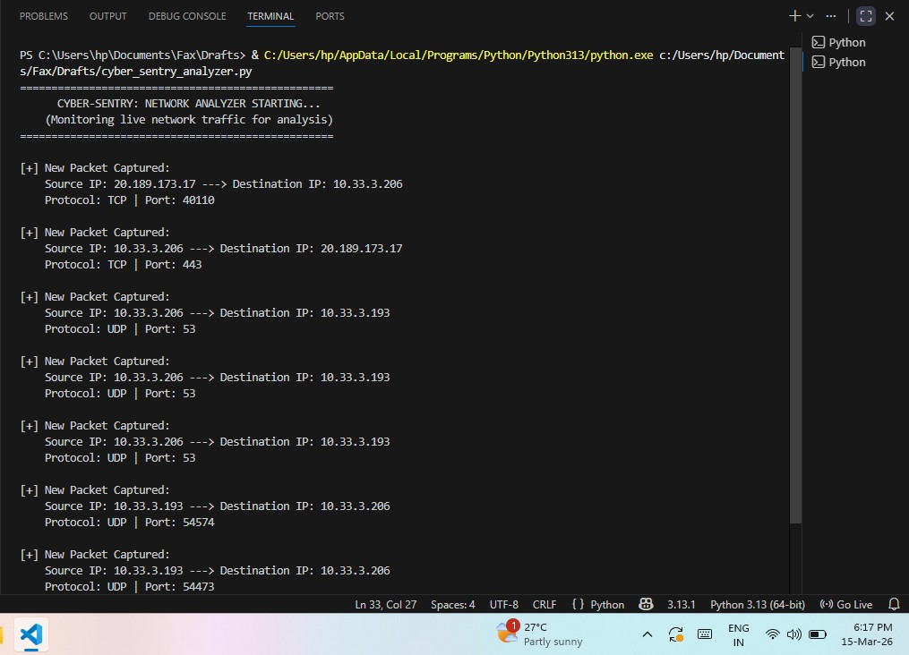

# 🛡️ Cyber-Sentry: Real-Time Network Packet Analyzer

**Cyber-Sentry** is a professional cybersecurity tool developed to capture, decode, and analyze live network traffic. Built using Python and the Scapy library, it provides a Command Line Interface(CLI) to monitor real-time data flow and perform Packet Inspection (DPI).

---

## 📸 Project Demo (Output)

> *Description: Real-time network traffic capture demonstrating active UDP and DNS queries. The output shows successful packet interception, source/destination IP tracking, and protocol identification using the Scapy engine.*

---

## 🚀 Key Features
* **Live Traffic Sniffing:** Captures real-time packets directly from the Network Interface Card (NIC).
* **Deep Packet Inspection (DPI):** Extracts and displays Source IP, Destination IP, and Protocol types.
* **Protocol Support:** Specialized analysis for **TCP** and **UDP** traffic.
* **Real-Time CLI Output:** A clean and structred terminal output for easy monitoring of live packets.

---

## 🛠️ Tech Stack
* **Language:** Python 3.x
* **Core Engine:** Scapy Library
* **Interface:** Command Line Interface(CLI)
* **Network Driver:** Npcap (WinPcap compatible)

---

## ⚙️ How to Run
1. Install [Npcap](https://npcap.com/#download).
2. Install Scapy: `pip install scapy`
3. Run as **Administrator**: `python cyber_gui_analyzer.py`

---

## 👤 Author
**Shweta** B.Tech CSE Student | 8.74 CGPA  
[Portfolio Website](https://codewithshweta1705.github.io/shweta-portfolio/)
